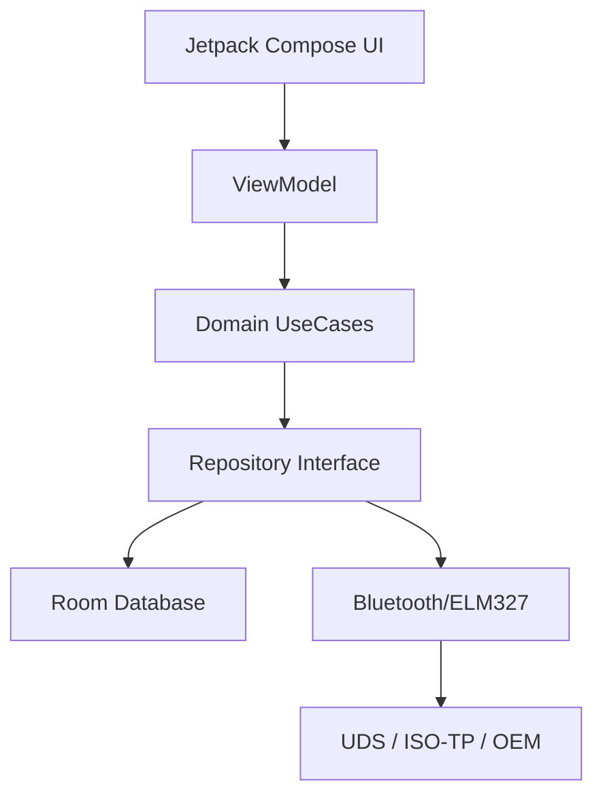

# Obelus Automotriz Scan 🚗🔧

**Scanner OBD2 profesional para Android con soporte avanzado UDS, diagnóstico específico por marca (VAG/BMW/Toyota) y modo carrera.**

Obelus transforma tu dispositivo Android en una potente herramienta de diagnóstico automotriz y telemetría en tiempo real.

---

## ✨ Características Principales

*   📊 **Dashboard Profesional**: Visualización de 10 PIDs en tiempo real (RPM, Velocidad, Temp, etc.) con gauges dinámicos.
*   🏁 **Modo Race (Drag Strip)**: Mediciones de rendimiento 0-100 km/h, 1/4 de milla y frenado, con cálculo de fuerzas G.
*   ⛽ **Eficiencia de Combustible**: Cálculo instantáneo y promedio de consumo (L/100km, MPG).
*   🔍 **Diagnóstico Avanzado (UDS)**: Soporte completo para Unified Diagnostic Services sobre ISO-TP (Servicios 0x10, 0x11, 0x22, 0x2E).
*   🏭 **Protocolos OEM**: Detección automática de marca por VIN para VAG, BMW y Toyota.
*   🛠️ **Gestión de DTCs**: Lectura y borrado de códigos de error con descripciones detalladas.
*   📱 **Widget de Inicio**: Datos vitales del vehículo directamente en tu pantalla de inicio con tecnología Jetpack Glance.
*   🎨 **Temas Dinámicos**: Soporte para Modo Claro/Oscuro y Material You.

## 📸 Capturas de Pantalla

| Dashboard | Race Mode | Configuración | Widget |
|:---:|:---:|:---:|:---:|
|  |  |  |  |

*(Imágenes referenciales de la versión v1.0)*

## 🚀 Instalación

### Requisitos
*   Dispositivo Android con **Android 8.0 (Oreo)** o superior.
*   Adaptador **ELM327 Bluetooth** (Versión 1.5 recomendada, v2.1 compatible).

### Descarga
Escanea el código QR o visita la sección de [Releases](https://github.com/zxNoritagami/Obelus-Automotiz-Scan/releases) para descargar el último APK.

### Última Versión

## 📖 Uso Rápido

1.  **Emparejar**: Conecta tu adaptador ELM327 al puerto OBD2 del vehículo y emparejalo en la configuración Bluetooth de Android.
2.  **Conectar**: Abre Obelus, selecciona tu dispositivo y presiona el icono de Bluetooth en la barra superior.
3.  **Escanear**:
    *   Ve al **Dashboard** para ver datos en vivo.
    *   Usa **Race Mode** para medir tiempos de aceleración (solo en pista cerrada).
    *   Usa **DTCs** para leer y borrar códigos de error.

## 🏗️ Arquitectura Técnica

El proyecto sigue una arquitectura moderna y robusta **MVVM (Model-View-ViewModel)** con principios de **Clean Architecture**:

*   **UI**: Jetpack Compose + Material3.
*   **DI**: Hilt (Dagger).
*   **Async**: Kotlin Coroutines + Flow.
*   **Persistence**: Room + DataStore.
*   **Protocol**: Implementación propia de ELM327, ISO-TP y UDS.

## 🤝 Contribuir

¡Las contribuciones son bienvenidas!

1.  Haz un **Fork** del repositorio.
2.  Crea una rama para tu feature (`git checkout -b feature/NuevaFuncionalidad`).
3.  Haz **Commit** de tus cambios (`git commit -m 'Añadir nueva funcionalidad'`).
4.  Haz **Push** a la rama (`git push origin feature/NuevaFuncionalidad`).
5.  Abre un **Pull Request**.

## ✅ Roadmap (Estado Actual)

*   [x] Configuración de Proyecto y Hilt (Módulo 11)
*   [x] UI/UX Dashboard y Navegación (Módulo 12)
*   [x] Lógica de Bluetooth y OBD2 (Módulo 13)
*   [x] Modo Carrera y Telemetría (Módulo 14)
*   [x] Protocolos Avanzados UDS/OEM (Módulo 15)
*   [x] CI/CD y Release Build

## 📄 Licencia

Desarrollado por **@zxNoritagami**.

Este proyecto está bajo la Licencia **MIT**. Consulta el archivo [LICENSE](LICENSE) para más detalles.

## ⚠️ Disclaimer

**Obelus Automotriz Scan** es una herramienta de diagnóstico. El uso de esta aplicación, especialmente en **Modo Carrera**, debe realizarse bajo su propia responsabilidad y respetando las leyes de tránsito locales. El autor no se hace responsable por daños al vehículo, violaciones de tráfico o accidentes derivados del uso de esta aplicación. **Nunca manipule la aplicación mientras conduce.**
